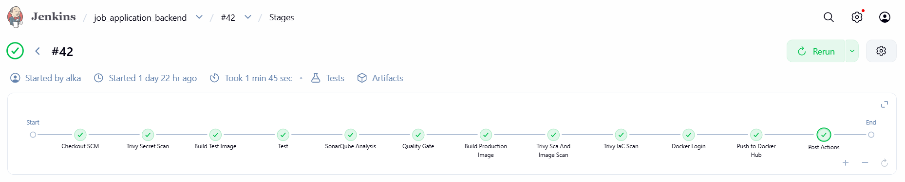
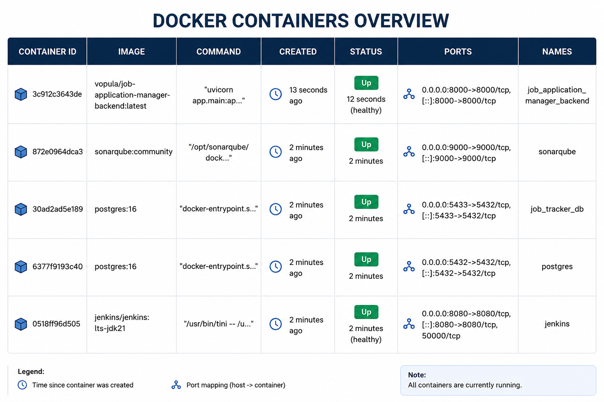

# Project Title
DevSecOps Project For Deployment with security check automation.

## Problem Statement
This job application manager backend doesn't has CI/CD installed for deployment. Without CI/CD, developer tend to do repetitive task with low value and wasting time.

## Tech Stack
Technology stack this project use are Docker, Dockerhub, Jenkins, SonarQube, Trivy, Pytest, Github.

## Features
1. CI/CD pipeline
2. Auto deployment
3. SAST, IaC, SCA, Image security scan

## Pipeline Screenshot


## How to Run Locally

This project uses **two separate `docker compose` files**, because they serve two different purposes and are meant to be deployed independently:

- **`architecture-docker-compose.yml`** — the DevSecOps infrastructure: Jenkins, SonarQube (with its own Postgres), and this app's own Postgres database.
- **`application-docker-compose.yml`** — just the app itself, pulled as a pre-built image from Docker Hub.

### 1. Install Docker
On a fresh Ubuntu/Debian server:
```bash
curl -fsSL https://get.docker.com | sh
sudo usermod -aG docker $USER   # allow running docker without sudo, re-login after this
```

### 2. Configure environment variables
```bash
cp .env.example .env
# edit .env — set real passwords and your GROQ_API_KEY
```
Both compose files below read from this same `.env` automatically.

### 3. Start the infrastructure (Jenkins, SonarQube, Postgres)
```bash
docker compose -f architecture-docker-compose.yml up -d
```
- Jenkins → http://localhost:8080 (get the initial admin password with `docker exec jenkins cat /var/jenkins_home/secrets/initialAdminPassword`)
- SonarQube → http://localhost:9000 (default login `admin` / `admin`)
- App's Postgres (`job_tracker_db`) → `localhost:5433`

### 4. Start the application
```bash
docker compose -f application-docker-compose.yml up -d
```
- App → http://localhost:8000 (docs at `/docs`, health check at `/health`)

Once everything above is running, `docker ps` should show all containers up and healthy:


### Networking
Both compose files share **one external Docker network** called `devsecops`, so containers started from either file can reach each other by container name — this is what lets the `app` container (from `application-docker-compose.yml`) connect to `job_tracker_db` (started by `architecture-docker-compose.yml`) without both services living in the same compose project.

- `architecture-docker-compose.yml` **creates** the network, with an explicit fixed name (`networks: devsecops: name: devsecops`) so it doesn't get an unpredictable auto-generated name.
- `application-docker-compose.yml` **attaches** to it as `external: true` — it expects the network to already exist.
- Inside that shared network, Docker's internal DNS resolves each container by its `container_name` — that's why `DATABASE_URL` in `application-docker-compose.yml` points to `job_tracker_db` as the hostname, not `localhost`.
- Every service also still publishes its port to the host machine (e.g. `5433:5432`, `8000:8000`), so you can reach any of them directly from outside Docker too.

> ⚠️ **Order matters**: step 3 (`architecture-docker-compose.yml`) must be run before step 4 (`application-docker-compose.yml`). If you run step 4 first, or the `devsecops` network was removed some other way, you'll see:
> ```
> network devsecops declared as external, but could not be found
> ```
> Fix by either running step 3 first, or creating the network manually: `docker network create devsecops`.

## CI/CD Configuration
Starting the containers isn't enough — Jenkins, GitHub, SonarQube, Trivy, Docker Hub, and the deploy server also need to be wired together (one-time, manual setup) before the pipeline works end-to-end.

### Jenkins → GitHub
This project targets an isolated network with no inbound path for a GitHub webhook, so the `Jenkinsfile` uses `pollSCM('H/5 * * * *')` — Jenkins polls GitHub for new commits every ~5 minutes, instead of GitHub pushing to Jenkins. If your Jenkins is publicly reachable, you can swap this for a real webhook instead (GitHub repo → `Settings → Webhooks` → point to `http://<jenkins-url>/github-webhook/`) for instant triggers.

### Jenkins → SonarQube
1. Install the **SonarQube Scanner** plugin (`Manage Jenkins → Plugins`).
2. `Manage Jenkins → Tools → SonarQube Scanner installations` → Add, name it exactly `SonarScanner` (must match `tool 'SonarScanner'` in `Jenkinsfile`), enable "Install automatically".
3. `Manage Jenkins → System → SonarQube servers` → Add, name it exactly `SonarQube` (must match `withSonarQubeEnv('SonarQube')`), Server URL = `http://sonarqube:9000` — the **container hostname**, not `localhost`, since Jenkins and SonarQube are separate containers on the same `devsecops` network — plus an authentication token generated from SonarQube (`My Account → Security → Generate Token`).

### SonarQube → Jenkins
For the `Quality Gate` stage to resolve instead of hanging until timeout, SonarQube needs to call Jenkins back once analysis finishes: in SonarQube, go to `Administration → Configuration → Webhooks` → Create → Name `Jenkins`, URL `http://jenkins:8080/sonarqube-webhook/` (container hostname, same network, **trailing slash required**).

### Jenkins → Trivy
No credentials needed. Trivy runs as a short-lived container per scan (`docker create` → `docker start` → `docker rm`), which the Jenkins container can spin up because `/var/run/docker.sock` is mounted into it (already configured in the `jenkins` service of `architecture-docker-compose.yml`).

### Jenkins → Docker Hub
`Manage Jenkins → Credentials` → Add credential, type **Username with password**, ID `jenkins-local-to-docker-hub`. Username = your Docker Hub username, Password = a Docker Hub **Access Token** (not your account password — required with 2FA, and safer regardless). The `Jenkinsfile` binds this as `DOCKERHUB_CREDENTIALS` and derives `IMAGE_NAME` from `DOCKERHUB_CREDENTIALS_USR` automatically, so images always get pushed under your own namespace, not Docker's reserved `library/` namespace.

### Jenkins → Deploy Server (SSH)
Two credentials, both under `Manage Jenkins → Credentials`:
- `ssh-account-to-isolated-network` — type **Username with password**, the SSH login for the deploy target.
- `isolated-vm-host` — type **Secret text**, containing just the server's IP/hostname.

Since this is password-based (not an SSH key), the Jenkins container also needs `sshpass` installed (e.g. `apt-get install -y sshpass` inside the container, or baked into a custom Jenkins image) for the `Deploy to Server` stage to work.

## Learning / Challenges
1. Jenkins `sh` steps halt on the first non-zero exit code. Commands expected to "fail" on purpose (e.g. a scanner flagging a vulnerability) need explicit `set +e` / `set -e` guards, or cleanup and result collection never run.
2. Vendored dependencies (a library bundled inside another tool, e.g. `msgpack` inside `pip`) can't be patched via `requirements.txt` — the fix must come from the parent tool's own release, or the tool gets removed if unused at runtime.
3. `docker system prune` deletes the dangling layers the legacy builder uses for caching, forcing every build to start from scratch. Filtering by age (`--filter "until=24h"`) preserves recent cache while still reclaiming disk space.

## Credits
I would like to express my sincere gratitude to codingSloth for making this project possible

## Contact
Linkedin: Alka Sidik Prawira